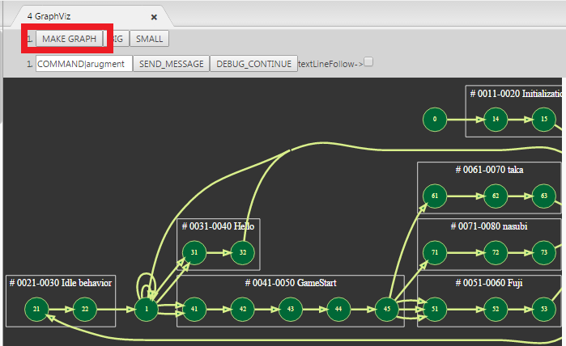
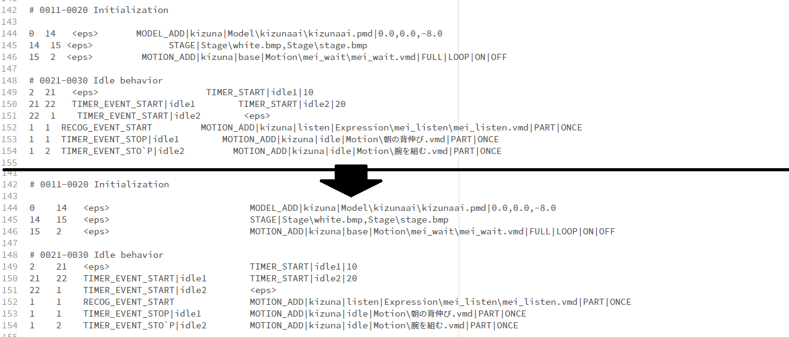
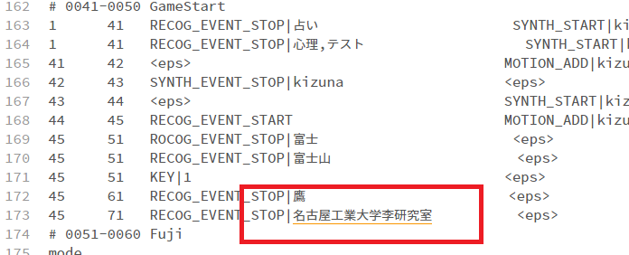
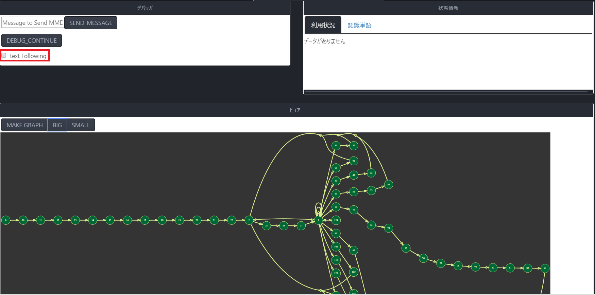
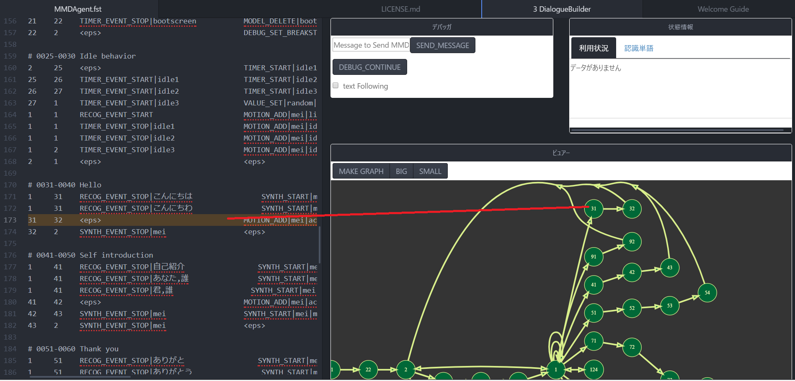
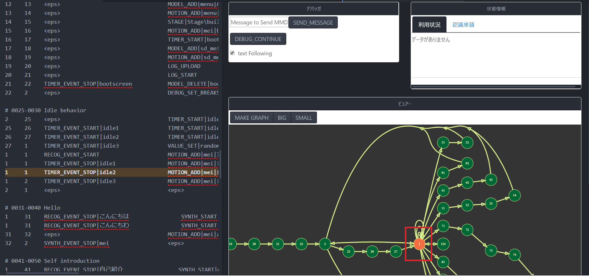
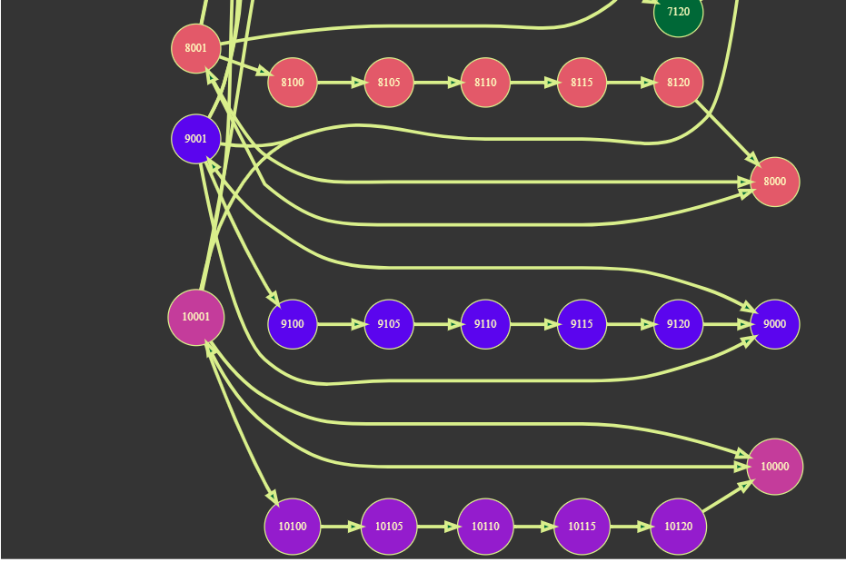
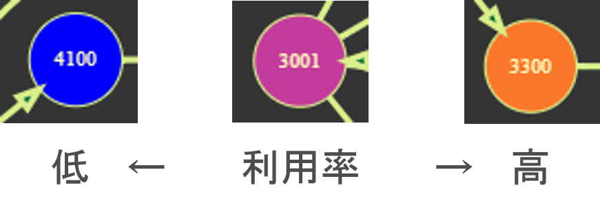

# HELEN-Dialogue-Interaction-Editor-for-MMDAgent-
MMDAgentのfstファイル編集のためのAtomエディタ用拡張パッケージです

## Description
fstファイル構築のための，記述補助，デバッグ補助，可視化の機能をまとめたものです．
音声対話構築のための統合エディタを目指しています．

## Install
HELENを使用する前にテキストエディタ「Atom」をインストールしてください．
インストールできたらHELENディレクトリを~/.atom/packages以下に移します．
（Windowsの場合はC:\Users\\***\\.atom\packages以下）

<!-- ```
$ cd ~/.atom/packages
$ git clone git@github.com:m-masaki72/DialogueBuilder.git
```
本プラグインをAtomエディタのプラグインフォルダ(.atom)にコピーしてください． -->

移動させたらAtomのプラグインを有効化します
（パッケージは，Atomのウィンドウをリロードすることで有効化可能）
※メニューからPackages→Command Palette→Toggleでコマンドラインを使って
Winodow:Reloadを実行でリロードできます．
インストールできたかどうかは，Packages→Settings View→Openで設定を開き，Packages→Community Packagesで確認できます．

## Demo

## Usage
- Draw Graph (*Ctrl + Alt + shift + g* )  
グラフ描画タブを開きます．  `MAKE_GRAPH`ボタンを押すことで描画を更新します．「BIG」「SMALL」ボタンでグラフの拡大・縮小ができます．


- Insert TAB(*Ctrl + Alt + shift + t* )  
自動でFSTを清書します．  


- checkDictionary(*Ctrl + Alt + shift + d* )  
内蔵辞書と比較して未知語を強調表示します．


- Send Command Message to MMDAgent  
`tools/mmdagent_exe/MMDAgent.exe`で起動するMMDAgentに対してコマンドを送ります．リアルタイムデバッグの手助けになります．


- Follow Line when MMDAgent is working  
チェックマークをONにすることでフォローモードを起動します．`tools/mmdagent_exe/MMDAgent.exe`で起動するMMDAgentに対してエディタ上において現在状態を強調表示するようになります．



## リアルタイムデバッグ表示  

`tools/mmdagent_exe/MMDAgent.exe`を起動するとリアルタイムデバッグ表示を行います．
図のように現在実行中の状態をグラフで色付けしながら動作させることが可能です．
一定時間起動し続けると不具合が発生することがあります．その際はエディタとMMDAgentをリロード(*shift + r* )してください．


## ログサーバとプロファイル生成手順
#### サーバの場所と実行
デフォルトポート8080，host0.0.0.0を開く．
```
cd ./tools/log_server
python flask_server.py
```
ポートにくるログ・ファイルを収集，MMDAgent側で指定されたフォルダ形式で保存していく．

#### ログからプロファイルの生成
<!-- ```
cd ./tools/log_server
python make_profile.py -path_of_the_log_file_Dircroty-
``` 


指定したパスと同じディレクトリにあるログファイルを生成してプロファイルを生成．
（同階層のログ・ファイルのみ，ディレクトリを掘ったりはしない）
-->

tools/log_server内にあるmake_profile.pyファイルをログファイルがあるディレクトリと同じディレクトリにコピーします．（ログファイルはPocket MMDAgent及びMMDAgent-exのLOGコマンドで生成されるログファイルです）

でてきた`MMDAgent.profile`をHELENで開いているFSTファイルにコピー，名前を統一します．
```
cp MMDAgent.profile -Path_to_FST_File-
mv MMDAgent.profile xxx.profile #xxx is same name of .fst file
```

以上の処理の後，HELENのビューアを更新すると以下のような強調表示が可能となります．


## プロファイル表示の判例



## Licence
MIT

## Author
[Masaki Mori(Nagoya Institie of Technology)](https://github.com/m-masaki72)